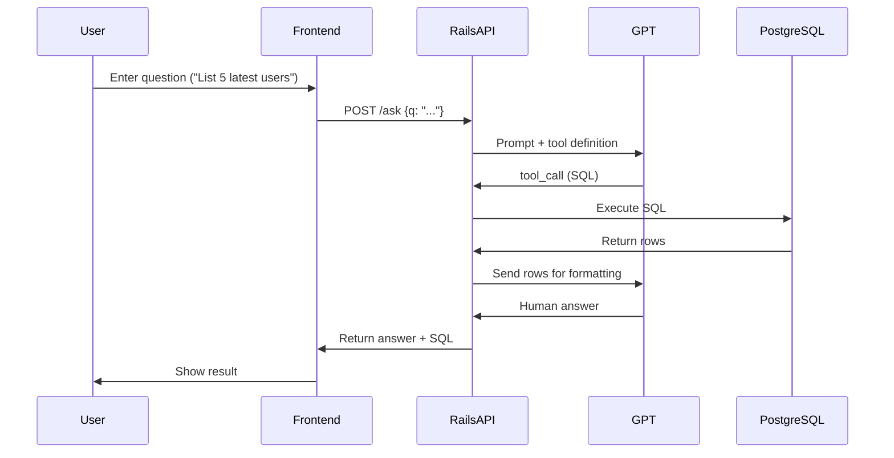

# AI–Powered Database Query System

Natural-Language → SQL → PostgreSQL → Human Answer

---

## 1. Purpose

This document explains how to implement an AI-powered system that:

- Accepts natural-language questions from users
- Uses OpenAI GPT (with function calling) to generate safe SQL
- Executes SQL on PostgreSQL
- Returns clear, natural-language answers

Suitable for:

- Admin dashboards
- Reporting systems
- Internal data lookup tools
- Multi-client environments (AI microservice)
- Direct embedding in client projects

---

## 2. Prerequisites

**Mandatory:**

- OpenAI developer account
- Billing enabled for OpenAI API usage
- At least one API key
- Working Rails project (API or non-API)
- Access to a PostgreSQL database

---

## 3. How to Get an OpenAI API Key

1. Visit: https://platform.openai.com
2. Create a project (optional)
3. Go to Developer → API Keys
4. Click "Create new secret key"
5. Copy the key (shown only once)
6. Store securely in your environment:
   ```bash
   export OPENAI_API_KEY="sk-xxxxxxxx"
   ```
   **Never commit API keys to Git.**

---

## 4. Setup Checklist (Step-by-Step)

- [ ] Create OpenAI account & enable API billing
- [ ] Create and store API key → `OPENAI_API_KEY`
- [ ] Add `gem "openai"` to Rails and run Bundler
- [ ] Add route: `POST /ask` (or new/create for non-API Rails)
- [ ] Implement `AiController`
- [ ] Implement SQL safety guard (SELECT-only)
- [ ] Add function-calling tool definition for GPT
- [ ] Add system prompt for SQL rules
- [ ] Test the pipeline locally
- [ ] Deploy and monitor usage/costs

---

## 5. Recommended Architecture Options

**Option A — AI Microservice (Standalone Rails API)**
Best for multiple client systems or languages.

```
Client App → AI Rails API → GPT (SQL) → PostgreSQL → GPT (Formatter) → Client
```

**Option B — Integrate AI directly into the client’s project**
Simplest, fastest option.
Works with Rails, Laravel, Node, Go, etc.

**Option C — Rails Engine**
Only useful if the client project itself is Rails (rare).

---

## 6. Data Flow (Fully Detailed with Data Formats)

1. **User → Frontend**
   User enters a natural-language question:

   ```json
   { "question": "List 5 latest users" }
   ```

2. **Frontend → Backend (Rails)**
   Frontend sends HTTP POST:

   ```json
   { "q": "List 5 latest users" }
   ```

3. **Backend → GPT (SQL Generation Stage)**
   Rails sends a structured request:

   ```json
   {
     "model": "gpt-5.1",
     "messages": [
       { "role": "system", "content": "SQL generator rules..." },
       { "role": "user", "content": "List 5 latest users" }
     ],
     "tools": [
       {
         "name": "query_database",
         "description": "Run a SQL SELECT query on PostgreSQL",
         "parameters": {
           "type": "object",
           "properties": {
             "sql": {
               "type": "string",
               "description": "A safe SQL SELECT query"
             }
           },
           "required": ["sql"]
         }
       }
     ]
   }
   ```

4. **GPT → Backend (tool_call response)**
   GPT responds with a tool_call instructing SQL execution:

   ```json
   {
     "tool_calls": [
       {
         "id": "call_12345",
         "name": "query_database",
         "arguments": {
           "sql": "SELECT id, email, created_at FROM users ORDER BY created_at DESC LIMIT 5"
         }
       }
     ]
   }
   ```

5. **Backend executes SQL on PostgreSQL**
   Rails validates + executes:

   - Only SELECT
   - No dangerous keywords
   - No semicolons
   - Optional LIMIT injection
   - Optional table whitelist

   Executes using:

   ```ruby
   ActiveRecord::Base.connection.exec_query(sql).to_a
   ```

   Example DB rows returned:

   ```ruby
   [
     {"id"=>12, "email"=>"arya@example.com", "created_at"=>"2025-01-11T10:00:00Z"},
     {"id"=>11, "email"=>"wafi@example.com", "created_at"=>"2025-01-10T09:00:00Z"}
   ]
   ```

6. **Backend → GPT (Answer Formatting Stage)**
   Rails sends the DB result back to GPT:

   ```json
   {
     "model": "gpt-5.1",
     "messages": [
       { "role": "system", "content": "SQL generator rules..." },
       { "role": "user", "content": "List 5 latest users" },
       {
         "role": "tool",
         "tool_call_id": "call_12345",
         "content": "[{\"id\":12,\"email\":\"arya@example.com\"}]"
       }
     ]
   }
   ```

7. **GPT → Backend (Final Answer)**
   GPT responds with a natural-language message:

   ```
   "Here are the 5 latest users: arya@example.com, wafi@example.com, ..."
   ```

8. **Backend → Frontend → User**
   API mode (JSON):
   ```json
   {
     "answer": "Here are the 5 latest users...",
     "sql": "SELECT id, email, created_at FROM users ORDER BY created_at DESC LIMIT 5"
   }
   ```
   Non-API Rails View (ERB):
   ```ruby
   @answer = "Here are the 5 latest users..."
   ```

---

## 7. Ruby on Rails Implementation Example

```ruby
class AiController < ApplicationController
  def create
    question = params[:q]

    # 1. Ask GPT to generate SQL
    response = client.chat(
      model: "gpt-5.1",
      messages: [
        { role: "system", content: system_prompt },
        { role: "user", content: question }
      ],
      tools: [query_tool]
    )

    tool_call = response.dig("tool_calls", 0)

    # If GPT answers directly (no SQL needed)
    unless tool_call
      return render json: { answer: response["content"] }
    end

    sql = tool_call["arguments"]["sql"]

    # 2. Validate + run SQL
    raise "Unsafe SQL" if unsafe_sql?(sql)
    rows = ActiveRecord::Base.connection.exec_query(sql).to_a

    # 3. Send DB result back to GPT for natural-language formatting
    final_answer = client.chat(
      model: "gpt-5.1",
      messages: [
        { role: "system", content: system_prompt },
        { role: "user", content: question },
        {
          role: "tool",
          tool_call_id: tool_call["id"],
          content: rows.to_json
        }
      ]
    )

    render json: { answer: final_answer["content"], sql: sql }
  end

  private

  def client
    OpenAI::Client.new(access_token: ENV["OPENAI_API_KEY"])
  end

  def system_prompt
    <<~PROMPT
      You are a PostgreSQL SQL assistant.
      - Only output safe SELECT queries.
      - Never output INSERT/UPDATE/DELETE/DROP.
      - No semicolons.
      - Keep queries simple and readable.
    PROMPT
  end

  def query_tool
    {
      name: "query_database",
      description: "Run a SQL SELECT query on PostgreSQL",
      parameters: {
        type: "object",
        properties: {
          sql: { type: "string", description: "A safe SQL SELECT statement" }
        },
        required: ["sql"]
      }
    }
  end

  def unsafe_sql?(sql)
    sql.match?(/\b(insert|update|delete|drop|alter|truncate)\b/i) || sql.include?(";")
  end
end
```

---

## 8. Security Guidelines

**Must enforce server-side:**

- SELECT-only queries
- Reject dangerous words (INSERT, UPDATE, DELETE, DROP, ALTER, TRUNCATE)
- Block semicolons
- Optional: Only allow queries on whitelisted tables
- Optional: Auto-add LIMIT 50 if missing
- Log all queries & GPT responses
- Rate-limit requests

**Never trust LLM-generated SQL.**

---

## 9. Local Testing Commands

```bash
export OPENAI_API_KEY="sk-xxxxx"
rails s
```

Test request:

```bash
curl -X POST http://localhost:3000/ask \
  -H "Content-Type: application/json" \
  -d '{"q": "List 5 latest users"}'
```

---

## 10. Deployment Notes

If using as a microservice, deploy on:

- Render
- Fly.io
- Heroku
- AWS/GCP/Dokku

**Ensure:**

- ENV keys are set
- Logs are protected
- HTTPS enabled
- Cost monitoring active

---

## 11. Summary

You now have a full architecture for:

- Natural language questions
- GPT-generated SQL (safe)
- Rails execution on PostgreSQL
- GPT-formatted answers
- Secure, efficient, production-ready flow

This setup can work:

- Inside a client’s project
- Or as a reusable AI microservice

---

## 12. Sequence Diagram



---

## 13. Flow Diagram

```mermaid
flowchart TD
    A[User] --> B[Frontend]
    B --> C[Rails API]
    C --> D[GPT (SQL Generation)]
    D --> E[Rails API (SQL Safety)]
    E --> F[PostgreSQL]
    F --> G[Rails API (Rows)]
    G --> H[GPT (Formatter)]
    H --> I[Rails API]
    I --> J[Frontend]
    J --> K[User]
```

---
